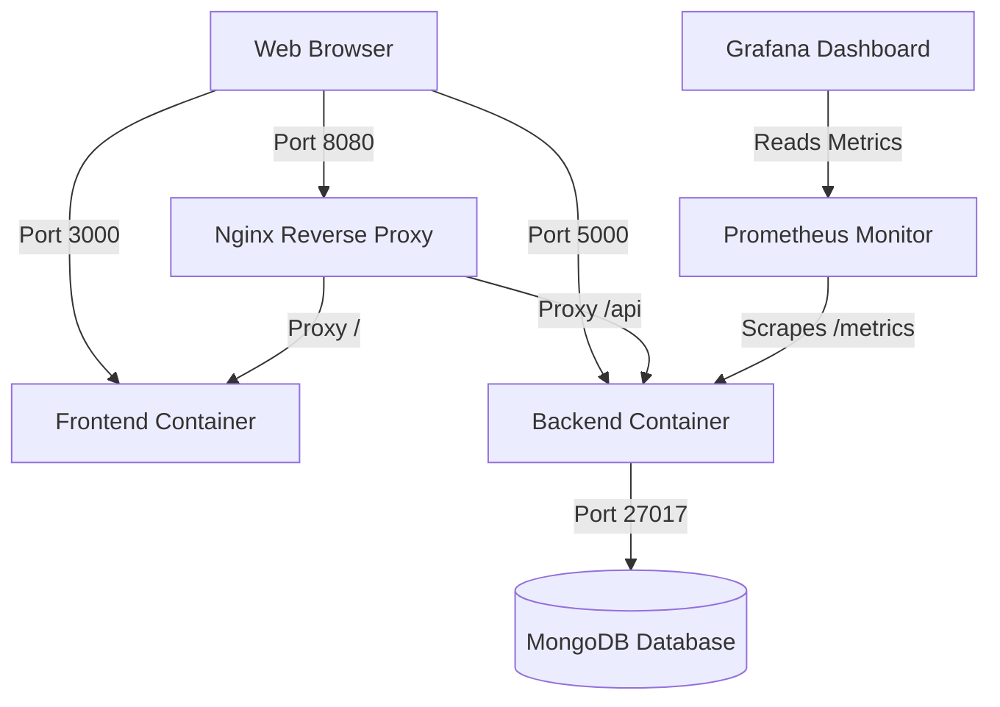

# FoodFly Dockerization & DevOps Guide

Welcome to the beginner-friendly guide for the Dockerized FoodFly application! This guide explains the containerization setup and provides all the commands you need to build, run, and manage your containers.

---

## 🏗️ Architecture Overview

The FoodFly application is structured as a multi-container microservice system. Instead of installing Node.js, MongoDB, and other tools locally on your host machine, everything runs in isolated containers communicating over a secure, private virtual network.

### Container Layout



---

## 📂 Configuration Breakdown

### 1. Frontend (`frontend/Dockerfile`)
The frontend uses a **multi-stage build** to optimize the final production image size:
- **Build Stage**: Runs on a lightweight `node:18-alpine` image, installs packages, and compiles the React/Vite app into optimized static files (`/app/dist`).
- **Production Stage**: Runs on `nginx:alpine` (around 20MB). It copies the compiled static files and uses a custom `nginx.conf` to handle single-page application (SPA) routing (fallback to `index.html`).

### 2. Backend (`backend/Dockerfile`)
A standard Node.js image (`node:18-alpine`) that sets the working directory, installs dependencies, copies the source code, exposes port `5000`, and starts the express server.

### 3. Orchestration (`docker-compose.yml`)
Docker Compose coordinates all containers. It specifies:
- **Restart Policies**: `restart: unless-stopped` ensures containers automatically restart if they crash or the system reboots.
- **Networks**: All containers are connected to `foodfly_network`, allowing them to communicate using container names as hostnames (e.g. backend connects to `mongodb:27017`).
- **Volumes**: `mongodb_data` persists database data on the host machine, ensuring database records are not lost when containers are stopped or deleted.
- **Health Checks**: The backend waits to start until the MongoDB container passes its health check (`mongosh --eval "db.adminCommand('ping')"`).

---

## 🛠️ Docker CLI Commands (Running Services Individually)

If you want to run and manage containers individually using the Docker CLI, follow these steps.

### Step 1: Create a Shared Network
Containers must be on the same network to talk to each other.
```bash
docker network create foodfly_network
```

### Step 2: Run MongoDB
Run MongoDB with a persistent volume to save your data.
```bash
docker run -d \
  --name foodfly_mongodb \
  --network foodfly_network \
  -p 27017:27017 \
  -v foodfly_db_data:/data/db \
  --restart unless-stopped \
  mongo:latest
```

### Step 3: Build & Run the Backend
Build the backend image and run it, passing environment variables.
```bash
# Build the backend image
docker build -t foodfly-backend ./backend

# Run the backend container
docker run -d \
  --name foodfly_backend \
  --network foodfly_network \
  -p 5000:5000 \
  -e PORT=5000 \
  -e MONGODB_URI=mongodb://foodfly_mongodb:27017/foodfly \
  -e JWT_SECRET=supersecretfoodflyjwtkey2024 \
  --restart unless-stopped \
  foodfly-backend
```

### Step 4: Build & Run the Frontend
Build the frontend image (injecting the API endpoint as a build argument) and run it.
```bash
# Build the frontend image
docker build -t foodfly-frontend --build-arg VITE_API_URL=http://localhost:5000 ./frontend

# Run the frontend container
docker run -d \
  --name foodfly_frontend \
  --network foodfly_network \
  -p 3000:80 \
  --restart unless-stopped \
  foodfly-frontend
```

---

## ⚡ Docker Compose Commands (Recommended)

Using Docker Compose is the easiest and most robust way to manage the entire stack with a single command.

### 1. Start the entire application
This command builds the images (if not built) and starts all containers in the background (**detached mode**):
```bash
docker-compose up -d
```

### 2. View running containers
Check the status of all containers:
```bash
docker-compose ps
```

### 3. Check container logs
Follow the real-time logs of all services (or append a service name like `backend` to view logs of only that container):
```bash
docker-compose logs -f
```
For a specific service:
```bash
docker-compose logs -f backend
```

### 4. Stop the application (keep data)
Stop and remove all containers, but preserve the MongoDB data volume:
```bash
docker-compose down
```

### 5. Stop the application (remove data)
Stop containers and completely wipe out the MongoDB volume (clean slate):
```bash
docker-compose down -v
```

### 6. Rebuild and restart after code modifications
If you make changes to frontend or backend source files:
```bash
docker-compose up -d --build
```

---

## 🌐 Service URLs & Access Ports

Once everything is running, you can access the different components at these addresses:

| Service | Host Port | Internal Port | URL | Description |
| :--- | :--- | :--- | :--- | :--- |
| **Nginx Proxy** | `8080` | `80` | [http://localhost:8080](http://localhost:8080) | Unified gateway (Routes `/api` to backend, `/` to frontend) |
| **Frontend** | `3000` | `80` | [http://localhost:3000](http://localhost:3000) | Direct frontend access |
| **Backend** | `5000` | `5000` | [http://localhost:5000/api/health](http://localhost:5000/api/health) | Backend health endpoint |
| **Prometheus** | `9090` | `9090` | [http://localhost:9090](http://localhost:9090) | Metrics scraping dashboard |
| **Grafana** | `3001` | `3000` | [http://localhost:3001](http://localhost:3001) | Visualization dashboard (User: `admin` / Pass: `admin`) |
| **MongoDB** | `27017` | `27017` | `mongodb://localhost:27017` | Database server connection URI |

---

## 🔄 CI/CD Jenkins Pipeline (`Jenkinsfile`)

A `Jenkinsfile` is configured in the root directory to automate building and deploying this setup in a Jenkins CI/CD environment. The pipeline performs the following stages:

1. **Checkout**: Retrieves the latest code from the source control repository.
2. **Install Dependencies**: Installs local npm packages for testing.
3. **Run Tests**: Executes mock/automated tests to verify codebase integrity.
4. **Build Docker Images**: Runs `docker-compose build` to compile the Docker images.
5. **Start Containers**: Spins up the entire stack using `docker-compose up -d`.

---

## 🔍 Troubleshooting & FAQs

### Q: Port 5000, 3000, or 27017 is already in use?
A: You likely have a local instance of Node.js, React, or MongoDB running on your host machine. Stop those services first, or modify the host ports (the left number) in `docker-compose.yml`. For example, change `"3000:80"` to `"3001:80"`.

### Q: Backend fails to connect to MongoDB?
A: Docker Compose will automatically wait for MongoDB to start because of the configured `healthcheck` and `depends_on`. If you run containers individually, make sure MongoDB is running and you pass the correct environment variable `MONGODB_URI=mongodb://foodfly_mongodb:27017/foodfly` (using the container name, NOT `localhost`).

### Q: Changes to my code are not showing up inside the containers?
A: Containers use static copies of the code copied during the build stage. To apply code changes, stop the containers and run:
```bash
docker-compose up -d --build
```
