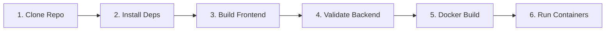

# FoodFly Jenkins CI/CD Pipeline & DevOps Guide

This guide explains how to set up, configure, and automate the deployment of the FoodFly application using Jenkins and Docker. The pipeline automatically pulls, builds, tests, and deploys the application inside Docker containers upon any code push to GitHub.

---

## 🛠️ 1. Jenkins Server Setup & Prerequisites

Before setting up the pipeline, ensure the following requirements are installed on your Jenkins host server:

### Prerequisites
1. **Docker & Docker Compose**: The Jenkins server must have Docker and Docker Compose installed.
2. **Node.js**: The Jenkins build agent requires Node.js (version 20+) to validate the code and compile the frontend asset packages on the host.
3. **Jenkins User Group Permission**: The `jenkins` system user must have permission to execute Docker commands:
   ```bash
   sudo usermod -aG docker jenkins
   sudo systemctl restart jenkins
   ```

### Required Jenkins Plugins
Log in to your Jenkins dashboard, navigate to **Manage Jenkins** > **Plugins** > **Available Plugins**, and install the following:
* **Pipeline**: Installs declarative pipeline support.
* **Git**: Integrates Jenkins with Git repositories.
* **NodeJS Plugin**: Allows Jenkins to automatically provision and use Node.js runtimes.
* **GitHub Integration Plugin**: Automatically registers webhooks and processes push events.

---

## 🏗️ 2. Configure Node.js in Jenkins Global Tools

To ensure Node.js is available on your Jenkins build agents:
1. Navigate to **Manage Jenkins** > **Tools**.
2. Scroll down to **NodeJS installations**.
3. Click **Add NodeJS**.
4. Name the installation `Node20` (or configure it to match the Node.js version installed on the host).
5. Select **Install automatically** and choose version **NodeJS 20.x**.
6. Save the settings.

---

## 🚀 3. Create the Jenkins Pipeline Job

1. On the Jenkins home page, click **New Item**.
2. Enter the name **`FoodFly-CI-CD`** and select **Pipeline**. Click **OK**.
3. Under **Build Triggers**, check **GitHub hook trigger for GITScm polling**. (This enables automatic deployments when GitHub sends webhooks).
4. Scroll down to the **Pipeline** section:
   * **Definition**: Select **Pipeline script from SCM**.
   * **SCM**: Select **Git**.
   * **Repository URL**: Paste your repository URL (e.g., `https://github.com/your-username/FoodFly.git`).
   * **Credentials**: Add your Git credentials if it is a private repository.
   * **Branch Specifier**: Enter `*/main` (or the branch you want to deploy, e.g., `*/master`).
   * **Script Path**: Verify it is set to **`Jenkinsfile`**.
5. Click **Save**.

---

## 🔗 4. Configure GitHub Webhook for Automatic Deployment

To trigger the Jenkins pipeline automatically after every push:

1. Go to your GitHub repository and click on **Settings** in the top navigation bar.
2. Click **Webhooks** in the left sidebar menu.
3. Click the **Add webhook** button.
4. Configure the webhook settings:
   * **Payload URL**: Enter your Jenkins webhook receiver URL:
     ```
     http://<YOUR_JENKINS_SERVER_IP_OR_DOMAIN>:<PORT>/github-webhook/
     ```
     *(Note: The trailing slash `/` is mandatory).*
   * **Content type**: Select **`application/json`**.
   * **Secret**: (Optional) Add a secret token to secure the payload if configured in Jenkins.
   * **Which events would you like to trigger this webhook?**: Select **Just the push event**.
   * **Active**: Check the checkbox to enable the webhook.
5. Click **Add webhook**.

*Once added, GitHub will send a test ping. A green checkmark next to the URL indicates a successful connection.*

---

## 🔄 5. CI/CD Workflow & Stage Explanations

The declarative pipeline configured in your `Jenkinsfile` runs the following stages sequentially:



### Stage Breakdowns
1. **Clone Repository**: Pulls the latest code specifier matching the branch from GitHub using `checkout scm`.
2. **Install Dependencies**: Runs `npm install` inside both `backend` and `frontend` folders on the build agent to load all packages required for verification.
3. **Build Frontend**: Executes `npm run build` for the React/Vite frontend on the agent host. This validates that the TypeScript/ES6 code compiles cleanly into static production assets before packaging.
4. **Build Backend**: Runs `node --check src/index.js` to scan the Express server code for syntax errors. This guarantees the backend script is valid.
5. **Build Docker Images**: Executes `docker-compose build` to compile the Docker images utilizing the optimized Node 20 environment.
6. **Run Docker Containers**: Executes `docker-compose up -d` to spin up or update the containers (`mongodb`, `backend`, `frontend`, `nginx`, etc.) in the background.

### Post-Build Actions
* **Success**: Prints a success message and confirms the FoodFly application is running.
* **Failure**: Alerts the developer that the pipeline broke and highlights that logs are available in the Console Output.
* **Always**: Cleans up workspace states and logs the finish event.
