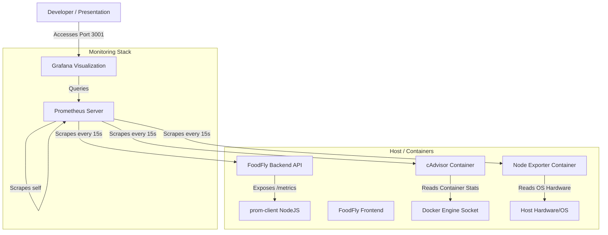

# FoodFly DevOps Monitoring Guide (Prometheus & Grafana)

This guide provides a comprehensive explanation of the monitoring stack configured for the FoodFly project. It includes service access details, metrics configuration, default credentials, and troubleshooting procedures.

---

## 📊 1. Monitoring Architecture

The FoodFly DevOps project leverages a standard metrics collection and visualization stack to monitor resource consumption and service status in real-time.



### Metrics Collectors:
1. **cAdvisor (Container Advisor)**: Analyzes and exposes resource usage (CPU, Memory, Network, Disk I/O) and performance characteristics of all running Docker containers.
2. **Node Exporter**: Measures host-level system metrics (CPU, RAM, Disk utilization) of the VM or server running the Docker containers.
3. **`prom-client` (NodeJS Client)**: Exposes application-level metrics (HTTP request latency, response statuses, query durations) on the `/metrics` endpoint of the backend Express app.

---

## 🌐 2. Services Access & Port Configurations

| Service | Internal Port | Exposed Host Port | URL | Default Credentials |
| :--- | :--- | :--- | :--- | :--- |
| **Grafana** | `3000` | `3001` | [http://localhost:3001](http://localhost:3001) | User: `admin` / Pass: `admin` |
| **Prometheus** | `9090` | `9090` | [http://localhost:9090](http://localhost:9090) | *No Authentication* |
| **cAdvisor** | `8080` | *Internal Only* | Scraped internally by Prometheus | *No Authentication* |
| **Node Exporter** | `9100` | *Internal Only* | Scraped internally by Prometheus | *No Authentication* |

---

## 📈 3. How to Access the Grafana Dashboard

Grafana has been pre-configured to automatically provision the Prometheus datasource and pre-load a custom developer dashboard upon startup:

1. Open your browser and navigate to [http://localhost:3001](http://localhost:3001).
2. Enter the default credentials:
   * **Username**: `admin`
   * **Password**: `admin`
3. If prompted to change the password, you can click **Skip** or configure a new password.
4. Click on **Dashboards** in the left sidebar menu (or search for dashboards).
5. Open the dashboard named **`FoodFly System Metrics`**.

### Dashboard Features:
* **Host CPU & RAM Gauges**: Real-time load indicators of the host operating system.
* **Services Status (Stat Panel)**: Uptime flags indicating if the Express backend and Prometheus server are ONLINE.
* **Container CPU Usage (Time-series)**: Graph showing CPU consumption of every container (`foodfly_backend`, `foodfly_frontend`, `foodfly_mongodb`, etc.) individually.
* **Container Memory Usage (Time-series)**: RAM utilization of all containers in bytes.
* **API Average Latency (Time-series)**: Average HTTP request durations broken down by method and route (e.g. `GET /api/health`).

---

## 🛠️ 4. Docker CLI Commands for Monitoring

### Start the full stack (including monitoring)
Starts all containers in detached mode and builds modified images:
```bash
docker compose up -d --build
```

### View container statuses
Confirm that all 8 containers are running:
```bash
docker compose ps
```

### View Prometheus scrape status
To inspect what scrapers are registered and active:
```bash
curl http://localhost:9090/api/v1/targets
```

### Inspect Grafana startup and provisioning logs
Ensure the datasource and dashboard files were successfully loaded by Grafana:
```bash
docker logs foodfly_grafana
```

---

## 🔍 5. Troubleshooting & FAQ

### Q: Why is Grafana displaying "No Data" on panels?
A: Prometheus requires a few seconds to begin scraping metrics once containers boot. Refresh the dashboard after 30 seconds. If the issue persists, go to **Connections** > **Data Sources** in Grafana and click **Test** on the Prometheus datasource to verify connectivity.

### Q: Why is cAdvisor crashing or failing to start?
A: On some Windows environments, mounting the root directory `/` or `/sys` in WSL can cause mounting issues depending on your WSL configuration. If cAdvisor fails to initialize, check the logs:
```bash
docker logs foodfly_cadvisor
```

### Q: How do I change the default admin password?
A: You can change the password on first login, or set the environment variable `GF_SECURITY_ADMIN_PASSWORD` to your desired value in `docker-compose.yml` under the `grafana` service.
