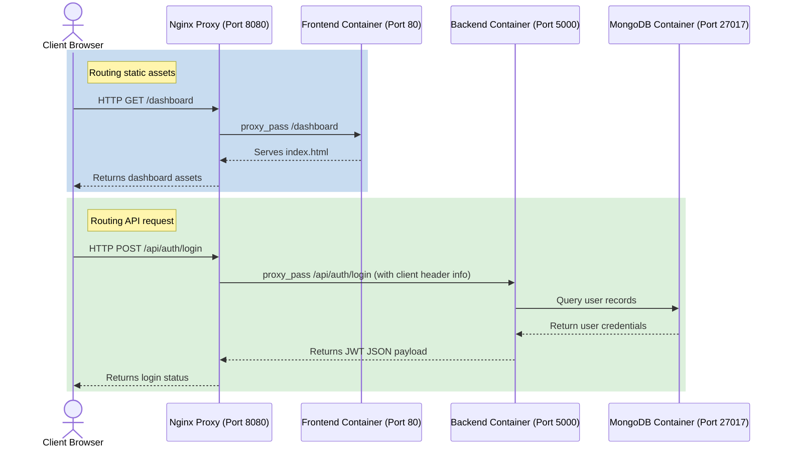

# FoodFly Nginx Reverse Proxy Setup & Routing Guide

This guide explains the reverse proxy architecture, request flow, and troubleshooting instructions for the Nginx proxy configured in the FoodFly DevOps project.

---

## 🌐 1. What is a Reverse Proxy?

A **Reverse Proxy** acts as an intermediary gateway between client browsers (the public internet) and your internal backend application containers. Instead of exposing your React frontend and Express backend directly to the public on separate ports (e.g. `3000` and `5000`), Nginx listens on a single port (`8080` on the host, `80` internally) and routes requests dynamically based on the URL path.

### Benefits of the Nginx Reverse Proxy:
* **Single Endpoint Access**: Avoids configuring CORS (Cross-Origin Resource Sharing) policies since all requests appear to originate from the same host and port.
* **Security Shield**: Hides individual container IP addresses and internal port layouts.
* **Optimized Deliveries**: Handles gzip file compression and caching for static HTML/JS assets to increase load speeds.
* **Load Isolation**: Controls client payload thresholds (e.g. max body upload size) and connection timeout windows.

---

## 🔄 2. End-to-End Request Flow

The following diagram illustrates how Nginx intercepts and dispatches incoming network traffic:



---

## 🛠️ 3. Nginx Configuration Summary (`nginx.conf`)

Our enhanced `nginx.conf` features several production-ready parameters:
1. **Upstream Definitions**:
   - `upstream frontend`: References `frontend:80` (resolves internally via the Docker bridge network DNS).
   - `upstream backend`: References `backend:5000`.
2. **Dynamic Location Blocks**:
   - `/api/` ── Routes to the Express backend (`http://backend/api/`).
   - `/` ── Routes all other traffic (routes, images, static assets) to the React/Vite web server.
3. **Proxy Headers**:
   - `Host $host`: Preserves the server domain requested by the client.
   - `X-Real-IP $remote_addr`: Exposes the client's actual IP address to the Express logs.
   - `X-Forwarded-For`: Tracks the chain of proxies the request has passed through.
   - `X-Forwarded-Proto $scheme`: Passes the protocol (HTTP or HTTPS) used by the client.
4. **Optimizations**:
   - **Gzip Compression**: Compresses data payloads before transfer.
   - **Timeouts**: Closes stale or stalled connections after `60 seconds` to optimize resource allocation.
   - **Payload Limits**: Restricts request bodies to `10 Megabytes` to prevent payload flood attacks.

---

## 🚀 4. Rebuild & Run Commands

If you make modifications to `nginx.conf`, restart the container or run a syntax validity check:

### Verify Nginx Configuration Syntax
Run this command inside the running Nginx container:
```bash
docker compose exec nginx nginx -t
```
*Expected output: `nginx: the configuration file /etc/nginx/nginx.conf syntax is ok`*

### Apply Configuration Changes (No Downtime)
Tell Nginx to reload its configuration files dynamically without stopping active connections:
```bash
docker compose exec nginx nginx -s reload
```

### Stop/Restart Nginx Container
```bash
docker compose restart nginx
```

---

## 🔍 5. Troubleshooting Guide

### Q: Why does Nginx fail to start with "Address already in use"?
A: Port `8080` is already in use by another software on your host machine (such as a local Jenkins server or tomcat).
* **Fix**: In the root `docker-compose.yml`, modify the `nginx` service port mapping. Change `"8080:80"` to another port like `"8082:80"`.

### Q: Getting a "502 Bad Gateway" when accessing the API?
A: A 502 error means Nginx is running, but it cannot connect to the backend container.
* **Fix 1**: Ensure the backend container is up by running `docker compose ps`.
* **Fix 2**: Check backend logs for startup crashes: `docker compose logs backend`.
* **Fix 3**: Make sure both services are attached to the same network (`foodfly_network` in your compose file).

### Q: Why are CSS or JS files missing or returning 404?
A: If static files are not loading, check that the Nginx MIME types are being loaded. Our updated `nginx.conf` explicitly loads `include /etc/nginx/mime.types;` to ensure all asset file types are served with the correct headers.
